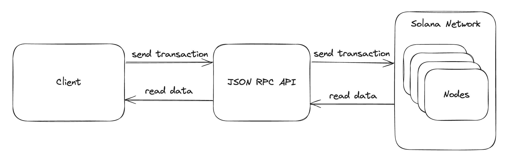

# High Level Developer Overview

- Solana can be broken down into two main parts:

- ``Onchain Program Development``: This is where you create and deploy custom programs directly to the blockchain. Once deployed, anyone who knows how to communicate with them can use them. You can write these programs in Rust, C, or C++. Rust has the most support for onchain program development today.

- ``Client Development``: This is where you write software (called decentralized applications, or dApps) that communicates with onchain programs. Your apps can submit transactions to perform actions onchain. Client development can be written in any programming language. 

- The "glue" between the client side and the onchain side is the ``Solana JSON RPC API``. 
- The client-side sends RPC requests to the Solana network to interact with onchain programs.
- The major difference with working on Solana is that the backend is a global permissionless blockchain. 
- 

- Solana development is a bit different from other blockchains because of its highly composable onchain programs
- This means you can build on top of any program already deployed, and often you can do so without needing to do any custom onchain program development

# Start

- To get started with Solana development, you'll need different tools based on whether you are developing for client-side, onchain programs, or both.

# Client-side Development

- developing on the client-side, you can work with any programming language you're comfortable with. Solana has community-contributed SDKs to help developers interact with the Solana network 
- You'll also need a connection with an RPC to interact with the network. You can either work with a RPC infrastructure provider or run your own RPC node.
- https://solana.com/rpc
- https://docs.solanalabs.com/operations/setup-an-rpc-node

- npx create-solana-dapp ..
- https://github.com/solana-developers/create-solana-dapp?tab=readme-ov-file#create-solana-dapp

# Onchain Program Development

- developing onchain apps, you should know Rust.
- Onchain program development consists of either writing programs in Rust, C, or C++
- When building onchain programs, you have a choice to either build with native Rust (ie, without a framework) or use the Anchor framework.
- Anchor is a framework that makes it easier to build on Solana by providing a higher-level API for developers.
- https://www.anchor-lang.com/

- Testing
- solana-program-test - Testing framework built in Rust
- https://docs.rs/solana-program-test/latest/solana_program_test/

# Developer Environments 

- Choosing the right environment based on your work is very important. On Solana, there are a few different network environments (called clusters) to facilitate mature testing and CI/CD practices

- ``Mainnet Beta``: The production network where all the action happens. Transactions cost real money here.
- ``Devnet``: The quality assurance network where you deploy your programs to test before deploying to production. Think "staging environment".
- ``Local``: The local network that you run on your machine using solana-test-validator to test your programs. This should be your first choice when developing programs.

# Build by Example

- Few more resources available to help accelerate your journey:

- Solana Cookbook: A collection of references and code snippets to help you build on Solana.
- https://solana.com/developers/cookbook

- Solana Program Examples: A repository of example programs providing building blocks for different actions on your programs.
- https://github.com/solana-developers/program-examples

- Guides: Tutorials and guides to walk you through building on Solana.
- https://solana.com/developers/guides

