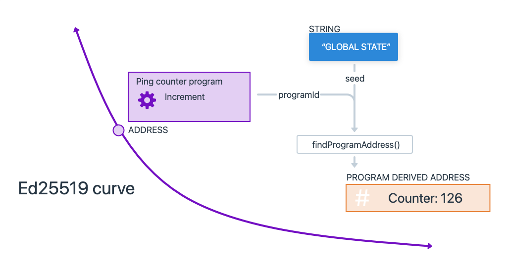

# Understanding Accounts: 
- Explore how data is stored on the Solana network.

# Sending Transactions: 
- Learn to interact with the Solana network by sending transactions.

# Building and Deploying Programs: 
- Create your first Solana program and deploy it to the network.

# Program Derived Addresses (PDAs): 
- Learn how to use PDAs to create deterministic addresses for accounts.

# Cross-Program Invocations (CPIs): 
- Learn how to make your programs interact with other programs on Solana.

# understand the structure of a Solana account.
- You can think of data on Solana as a public database with a single "Accounts" table, where each entry in this table is an individual account.

# Solana accounts contain either:

    - State: This is data that's meant to be read from and persisted. It could be information about tokens, user data, or any other type of data defined within a program.
    - Executable Programs: These are accounts that contain the actual code of Solana programs. They contain the instructions that can be executed on the network.
    - This separation of program code and program state is a key feature of Solana's Account Model.

# Token Extensions Program Account
-  The Token Extensions program is an executable program account
-  Token Extensions program, an executable program for interacting with tokens on Solana.

# Program Executable Data Account
- The Program Executable Data Account contains the compiled bytecode for the Token Extensions Program

#  Mint account, 
- which represents a unique token on the Solana network.

# Solana Network
-  On Solana, we interact with the network by sending transactions made up of instructions. These instructions are defined by programs, which contain the business logic for how accounts should be updated.

# Create a Token
- create a new token by creating and initializing a Mint account
- Invoke the System Program to create a new account
- Invoke the Token Extensions Program to initialize the account data

# Build, Deploy, and Test a simple Solana program using the Anchor framewor

Only the upgrade authority of the program can close it. The upgrade authority is set when the program is deployed, and it's the only account with permission to modify or close the program. If the upgrade authority is revoked, then the program becomes immutable and can never be closed or upgraded.

When deploying programs on Solana Playground, your Playground wallet is the upgrade authority for all your programs.

# Program Derived Address

# What is a PDA 
- PDAs are addresses that are deterministically derived and look like standard public keys, but have no associated private keys.
- This means that no external user can generate a valid signature for the address. However, the Solana runtime enables programs to programmatically "sign" for PDAs without needing a private key.
- 
- A PDA can then be used as the address (unique identifier) for an on-chain account, providing a method to easily store, map, and fetch program state.
- 

- PDAs provide developers on Solana with two main use cases:
    - ``Deterministic Account Addresses``: PDAs provide a mechanism to deterministically derive an address using a combination of optional "seeds" (predefined inputs) and a specific program ID.
    - ``Enable Program Signing``: The Solana runtime enables programs to "sign" for PDAs which are derived from its program ID.

- 
- PDAs are addresses derived deterministically using a combination of user-defined seeds, a bump seed, and a program's ID.
- PDAs are addresses that fall off the Ed25519 curve and have no corresponding private key.
- Deriving a PDA does not automatically create an on-chain account
- An account using a PDA as its address must be explicitly created through a dedicated instruction within a Solana program.

# How to derive a PDA
- Optional seeds: Predefined inputs 
- Bump seed: An additional input
- Program ID: The address of the program the PDA is derived from.
- 

- FindProgramAddress: findProgramAddressSync(optional seeds, program ID) method from @solana/web3.js.
- CreateProgramAddress: CreateProgramAddress(optional seeds + bump, program ID)
- Canonical Bump : 

- The program will store a user's message using a Program Derived Address (PDA) as the account's address.
- Define Message Account Type
- Implement Create Instruction
    - Implement the create instruction to create and initialize the MessageAccount.
    - Start by defining the accounts required for the instruction by updating the Create struct.
    - Implement the business logic for the create instruction by updating the create function.
- Implement the update instruction
    - Implement the update instruction to update the MessageAccount with a new message
    - Just as before, the first step is to specify the accounts required by the update instruction.
    - Update the Update struct
- Implement the delete instruction

# CPI
- A Cross Program Invocation (CPI) refers to when one program invokes the instructions of another program. This mechanism allows for the composability of Solana programs.

- CPIs enable Solana program instructions to directly invoke instructions on another program.
- Signer privileges from a caller program are extended to the callee program.
- When making a CPI, programs can "sign" on behalf of PDAs derived from their own program ID.
- The callee program can make additional CPIs to other programs, up to a maximum depth of 4.

# How to write a CPI
- Writing an instruction for a CPI follows the same pattern as building an instruction to add to a transaction
- Each CPI instruction must specify the following:
- ``Program address``: Specifies the program being invoked
- ``Accounts``: Lists every account the instruction reads from or writes to, including other programs
- ``Instruction Data``: Specifies which instruction on the program to invoke, plus any additional data required by the instruction (function arguments)

# CPIs using either one of the following functions from the solana_program crate:
- invoke - used when there are no PDA signers
- invoke_signed - used when the caller program needs to sign with a PDA derived from its program ID

# Basic CPI 
- 

# Core Concepts

- Build a strong understanding of the core concepts that make Solana different from other blockchains. Understanding the "Solana programming model" through these core concepts is very important to maximize your success as a Solana blockchain developer.

- Solana Account Model
- Transactions and Instructions 
- Fees on Solana
- Programs on Solana
- Program Derived Address
- Cross Program Invocation
- Tokens on Solana
- Clusters and Endpoints

# Solana Account Model

- On Solana, all data is stored in what are referred to as "accounts”.
- The way data is organized on Solana resembles a key-value store, where each entry in the database is called an "account".
-     
- Accounts can store up to 10MB of data, which can consist of either executable program code or program state.
- Accounts require a rent deposit in SOL, proportional to the amount of data stored, which is fully refundable when the account is closed.
- Every account has a program "owner". Only the program that owns an account can modify its data or deduct its lamport balance. However, anyone can increase the balance.
- Programs (smart contracts) are stateless accounts that store executable code.
- Data accounts are created by programs to store and manage program state.
- Native programs are built-in programs included with the Solana runtime.
- Sysvar accounts are special accounts that store network cluster state.

# Account
- Each account is identifiable by its unique address, represented as 32 bytes in the format of an Ed25519 PublicKey
- address(account)
    - AccountInfo 
        - data -> A byte array that stores the state of an account. If the account is a program (smart contract), this stores executable program code. This field is often referred to as the "account data".
        - executable -> 
        - lamports -> the account's balance in lamports, the smallest unit of SOL (1 SOL = 1 billion lamports).
        - Owner -> Specifies the public key (program ID) of the program that owns the account. 
        - https://github.com/solana-labs/solana/blob/27eff8408b7223bb3c4ab70523f8a8dca3ca6645/sdk/program/src/account_info.rs#L19

# Native Programs
- Solana contains a small handful of native programs that are part of the validator implementation and provide various core functionalities for the network.
- When developing custom programs on Solana, you will commonly interact with two native programs, the System Program and the BPF Loader.
- https://docs.anza.xyz/runtime/programs/

# System Program
- By default, all new accounts are owned by the System Program
- New Account Creation: Only the System Program can create new accounts.
- Space Allocation: Sets the byte capacity for the data field of each account.
- Assign Program Ownership: Once the System Program creates an account, it can reassign the designated program owner to a different program account. This is how custom programs take ownership of new accounts created by the System Program.
- https://github.com/solana-labs/solana/tree/27eff8408b7223bb3c4ab70523f8a8dca3ca6645/programs/system/src

# BPFLoader Program 
- The BPF Loader is the program designated as the "owner" of all other programs on the network, excluding Native Programs. It is responsible for deploying, upgrading, and executing custom programs.
- https://github.com/solana-labs/solana/tree/27eff8408b7223bb3c4ab70523f8a8dca3ca6645/programs/bpf_loader/src

# Sysvar Accounts
- special accounts located at predefined addresses that provide access to cluster state data. These accounts are dynamically updated with data about the network cluster. 
- https://docs.solanalabs.com/runtime/sysvars

# Custom Programs - When new programs are deployed on Solana, technically three separate accounts are created:

# Program Account - “Program ID”
- ``Program Account``: The main account representing an on-chain program. This account stores the address of an executable data account (which stores the compiled program code) and the update authority for the program (address authorized to make changes to the program).
- ``Program Executable Data Account``: An account that contains the executable byte code of the program.
- ``Buffer Account``: A temporary account that stores byte code while a program is being actively deployed or upgraded.  Once the process is complete, the data is transferred to the Program Executable Data Account and the buffer account is closed.
- TokenzQdBNbLqP5VEhdkAS6EPFLC1PHnBqCXEpPxuEb
- 

# Data Account

- Program accounts only contain the program's executable byte code. To store and modify additional data, new accounts must be created. 
- creating a data account for a custom program requires two steps:
- Invoke the System Program to create an account, which then transfers ownership to a custom program
- Invoke the custom program, which now owns the account, to then initialize the account data as defined in the program code
- 
